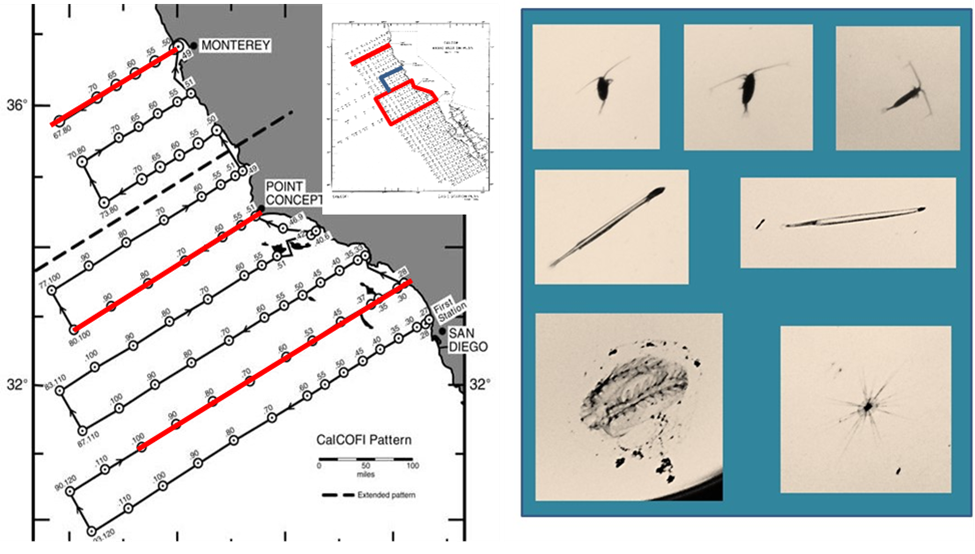

The project will demonstrate the use of these enhancements to support glider-based ecosystem surveys off the west coast, in the California Current, and provide knowledge and support for the development of these surveys in other regions. The results of these surveys will support our management needs, with the capacity to augment and potentially replace some ship-based ecosystem surveys.

This project is planned for 2026.

### Background

The use of autonomous underwater gliders to conduct ecosystem studies has been demonstrated by NMFS in a number environments including the Southern Ocean, where gliders equipped with scientific echosounders have been used to replace ship-based acoustic trawl surveys and in the Atlantic where passive acoustic recorders attached to gliders are used operationally to monitor North Atlantic Right whales. Recent transformative investments by the US Antarctic Marine Living Resources Program (SWFSC) for the development of a shadowgraph camera system that can image plankton on gliders has expanded the ability for gliders to collect ecosystem data at the base of the food web.

{width="544"}

Earlier projects such as the REFOCUS project demonstrated that ecosystem gliders (in coordination with other fleets of gliders collecting more physical data) could augment or partially substitute for NOAA's ship-based fisheries and ecosystem surveys in the California Current by conducting multi-glider surveys independent of ships and include plankton sampling. SWFSC successfully completed the first glider-based shadowgraph deployments in Antarctica in 2022, with additional testing and data collection efforts in the California Current.

### Objectives

The objectives of Plankton to Whales is to demonstrate the use of glider-based ecosystem surveys off the west coast, in the California Current, and to use these developments to inform adoption of glider ecosystem studies in other regions.
