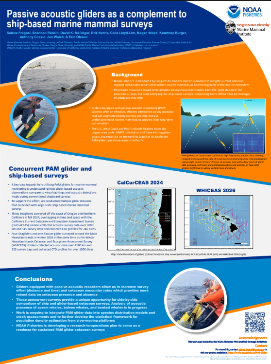
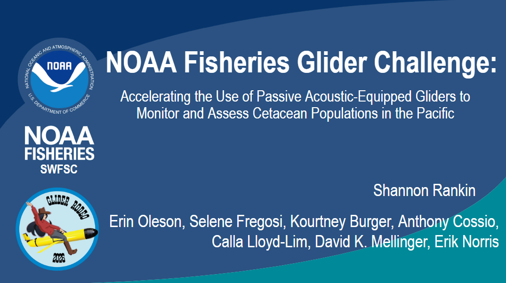
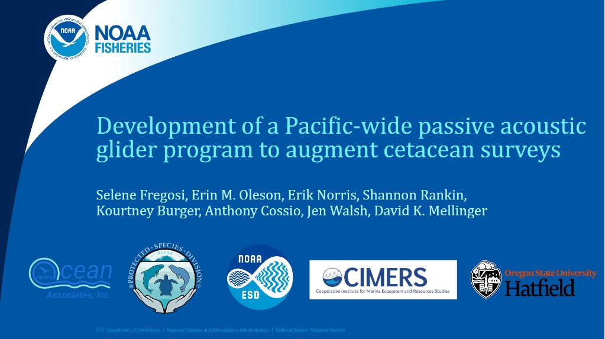
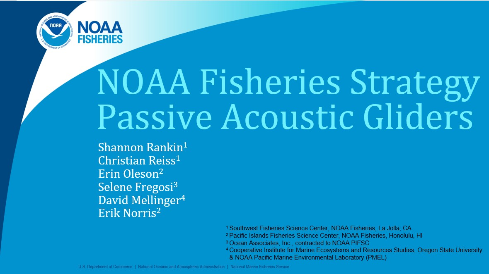
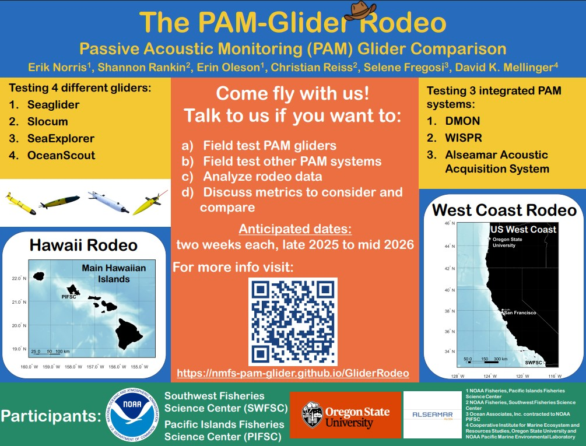

## Presentations

### Passive acoustic gliders as a complement to ship-based marine mammal surveys, [Underwater Glider User Group Workshop 2026](https://underwatergliders.org/ug2-workshop-st-pete-florida-26/)

- **Selene Fregosi**, Shannon Rankin, David K. Mellinger, Erik Norris,
  Calla Lloyd-Lim, Megan Wood, Kourtney Burger, Anthony Cossio, Jen
  Walsh, Erin M. Oleson

- **Abstract** Buoyancy-driven underwater gliders equipped with passive
  acoustic recorders are an increasingly important tool for marine
  mammal monitoring. Gliders can operate year-round, access remote
  offshore regions, and collect high-frequency recordings suitable for
  detecting most marine mammal species. As a result, the U.S. National
  Marine Fisheries Service is working to use passive acoustic monitoring
  (PAM) gliders to augment traditional ship-based visual and acoustic
  surveys in the Pacific. A key step in this application is
  understanding how glider-based acoustic observations relate to
  detections made during conventional shipboard surveys. To support this
  effort, multiple deployments have been conducted to coincide with
  large-scale ship-based marine mammal surveys. In fall 2024, three PAM
  gliders surveyed more than 3,000 km over 145 survey days along the
  U.S. West Coast, overlapping in time and space with a portion of a
  ship-based marine mammal abundance survey off Oregon and California.
  Similarly, in winter and spring 2026, five PAM gliders conducted
  deployments of up to 12 weeks throughout the Main Hawaiian Islands
  concurrent with a ship-based survey. These coordinated efforts provide
  a unique opportunity to evaluate how glider-based PAM can complement
  traditional survey methods while expanding spatial and temporal
  coverage. This presentation will describe the survey design,
  operational coordination between glider and ship platforms, and the
  broader effort to incorporate glider-based PAM into sustained marine
  mammal monitoring programs in the Pacific.

- **Links:**
  [Slides](https://github.com/nmfs-ost/PAM-Glider/blob/main/supplemental/Presentations/fregosi_UG2_2026_StPete_pam_glider_surveys.pdf)

### NOAA Fisheries Glider Challenge: Accelerating the Use of Passive Acoustic-Equipped Gliders to Monitor and Assess Cetacean Populations in the Pacific, [Underwater Glider User Group Workshop 2026](https://underwatergliders.org/ug2-workshop-st-pete-florida-26/)

- Erin M. Oleson, **Shannon Rankin**, Selene Fregosi, Kourtney Burger,
  Anthony Cossio, Calla Lloyd-Lim, David K. Mellinger, Erik Norris

- **Abstract:** Profiling gliders equipped with passive acoustic
  monitoring (PAM) sensors have been used in several marine mammal
  monitoring applications, often focused on identifying marine mammal
  occurrences to understand animal distribution or for threat
  mitigation. Building on this prior work, the U.S. National Marine
  Fisheries Service (NMFS) is carrying out a multiphase effort to
  accelerate the transition from research and development to operational
  marine mammal surveys using PAM-gliders in the Pacific. The first
  phase of this effort was the NMFS glider challenge, launched in Hawaii
  in January 2026. Concurrent in-water instrumentation testing included
  Seagliders, the Hefring Oceanscout provided by Cornell University, the
  Alseamar SeaExplorer, and Teledyne Slocum gliders equipped with DMON,
  WISPR, and JASCO acoustic sensors. Eight gliders carrying a variety of
  PAM packages navigated a figure-8 track offshore of Oahu, Hawaii over
  a 2 week period. The track included multiple phases designed to
  examine trade-offs between survey design, noise levels, sensor
  combinations, and piloting and navigation for survey-specific
  objectives. This “glider rodeo” is one part of an intensive
  research-tooperations program focused on quickly accelerating NMFS use
  of uncrewed systems to augment or replace ship-based marine mammal,
  ecosystem, and fisheries surveys across vast regions of the Pacific
  where ship surveys are logistically difficult and sustaining the
  necessary survey frequency is cost prohibitive. This presentation will
  describe the initial results of the glider rodeo, including basic
  performance metrics and findings that are guiding NMFS’ future
  investments in PAM-equipped gliders.

- **Links:**
  [Slides](https://github.com/nmfs-ost/PAM-Glider/blob/main/supplemental/Presentations/Rankin_UG2_presentation_May2026.pdf)

### Development of a Pacific-wide Passive Acoustic Glider Program to Augment Cetacean Surveys, [Protected Species Assessment Workshop 2025 (PSAW IV)](https://www.fisheries.noaa.gov/event/protected-species-assessment-workshop-psaw-iv)

{width="314"}

- **Selene Fregosi**, Erin Oleson, Erik Norris, Shannon Rankin, Kourtney
  Burger, Anthony Cossio, Jen Walsh, David Mellinger

- **Abstract:** A collaborative effort between PIFSC, SWFSC and OSU/PMEL
  aims to accelerate NMFS’s use of passive acoustic monitoring (PAM)
  glider surveys to augment existing ship-based surveys for cetacean
  stock assessment. This effort builds on historically successful
  efforts by NMFS to use PAM-equipped gliders including studies of
  endangered right whales off the U.S. East Coast and odontocetes around
  the Main Hawaiian Islands. This previous work highlighted the
  feasibility of using PAM-equipped gliders to bolster data collection
  efforts for cetacean surveys. Use of gliders is of particular interest
  in the Pacific region, which is the largest area under NMFS
  jurisdiction and is subject to acute shortages of adequate ship time;
  therefore, this region must identify survey modalities that maintain
  assessment operations over as large an area as possible. While the
  initial effort is focused in the Pacific region, this project will
  result in a Research-to-Operations plan that can be adapted or applied
  in other regions. Primary goals of this work are to (1) build capacity
  to sustain glider operations within NMFS through purchasing equipment,
  developing infrastructure, and hiring piloting and technical
  staff; (2) conduct detailed in-water instrumentation testing and
  comparison of currently available glider and sensor types to provide
  guidance for various use cases; (3) conduct concurrent glider and
  shipboard surveys off both the U.S. West Coast and Main Hawaiian
  Islands which will provide a unique opportunity to compare these two
  data streams; and (4) advance animal distribution modeling methods to
  integrate the PAM-glider collected data into stock assessments.

- **Links:**
  [Slides](https://github.com/nmfs-ost/PAM-Glider/blob/main/supplemental/Presentations/PSAWIV_2025_Fregosi_Pacific-wide%20passive%20acoustic%20gliders.pdf),
  \[Video\]

- Also presented at [ASA Honolulu December
  2025](https://acousticalsociety.org/honolulu-2025/)

### NOAA Fisheries’ Strategy for Passive Acoustic Gliders, UG2 Workshop '24

{width="296"}

- **Shannon Rankin**, Christian Reiss, Erin Oleson, Selene Fregosi,
  David K. Mellinger, Erik Norris

- **Abstract:** NOAA Fisheries has developed a strategic goal of
  investing in passive acoustic monitoring (PAM) from underwater gliders
  as part of an effort to build a dynamically managed fisheries system
  that accounts for climate change and supports science- based
  management and conservation. PAM-equipped gliders provide an
  autonomous solution to collecting encounter datasets for vocal species
  that can serve NMFS assessment needs. With dedicated R&D effort,
  PAM-equipped gliders can augment and replace some ship-based survey
  efforts, informing climate assessments, including changes in range or
  space use, and quantitative metrics, including population density. As
  part of this strategic initiative, NOAA Fisheries will lead a 3-year
  effort to accelerate the transition to operations for PAM-based glider
  surveys. The goal will be to develop a research-to-operations plan to
  implement PAM-equipped glider surveys that support their marine mammal
  assessments. The effort includes (1) the Glider Rodeo, (2) concurrent
  glider and shipboard surveys, and (3) the Plankton to Whales project.
  The Glider Rodeo \[see associated presentation\], involving in-water
  testing of several PAM-glider systems, has the goal of examining
  glider and sensor choices and how these choices may vary based on
  regional differences in assessment needs and oceanographic realities.
  The concurrent surveys include deploying several PAM-equipped gliders
  in association with two large-scale assessment surveys: PacMAPPS West
  Coast in 2024 and PacMAPPS Hawaii in 2026. These surveys provide an
  opportunity to collect glider datasets that can be compared alongside
  traditional cetacean survey data to guide future survey design and
  analytical advancements. The Plankton to Whales project is a pilot
  study that will provide seasonal autonomous ecosystem sampling from
  plankton to whales using paired PAM and oceanographic gliders with
  shadow- graph sensors for observing plankton.

- **Links:**
  [Slides](https://github.com/nmfs-ost/PAM-Glider/tree/main/supplemental/Presentations/Rankin_NMFS-PAM-UxS_presentation_UG2_2024.pdf)

### The Glider Rodeo: NOAA Fisheries’ Passive Acoustic Underwater Glider Comparison, UG2 Workshop '24

{width="365"}

- **Erik Norris**, Shannon Rankin, Erin Oleson, Christian Reiss, Selene
  Fregosi, David K. Mellinger

- **Abstract:** As part of a strategic goal to invest in passive
  acoustic monitoring using the uncrewed systems strategic initiative,
  NOAA Fisheries is pursuing field tests of several underwater gliders
  equipped with passive acoustic monitoring (PAM) systems. These tests
  will take place during two 2-week ‘glider rodeos’ planned for the U.S.
  West Coast and Hawaii in 2025-2026. Testing will include Slocum
  (Teledyne Webb), Seaglider (Univ. Washington), OceanScout (Hefring),
  and SeaExplorer (Alseamar) platforms with DMON, WISPR, and Alseamar
  acoustic acquisition systems. A pre-designed survey path will allow
  resampling of the same area by each glider over each 2-week effort to
  maximize spatial and temporal overlap. Glider performance and acoustic
  recording and detection metrics will be measured for each system to
  enable comparison and inform future glider acquisitions and use by
  NOAA Fisheries. Metrics under consideration include survey, data
  quality, and acoustic metrics. This is a unique opportunity to examine
  the performance and capability of a diverse set of currently available
  PAMequipped underwater gliders, and we welcome community input into
  test design and assessment metrics. There may be unfunded
  opportunities for participation to compare other systems if they are
  provided, and we will offer logistical support when possible. Results
  will be made publicly available to inform future research and
  development.

- **Links:**
  [Poster](https://github.com/nmfs-ost/PAM-Glider/tree/main/supplemental/Presentations/Norris-UG2-Poster_v4_2024.pdf)

## Publications
