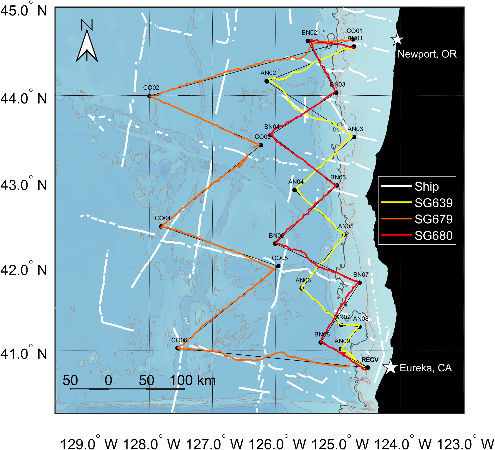
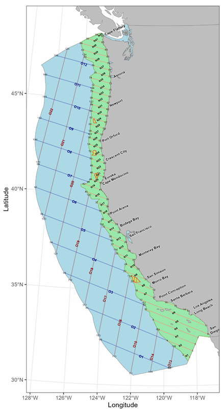
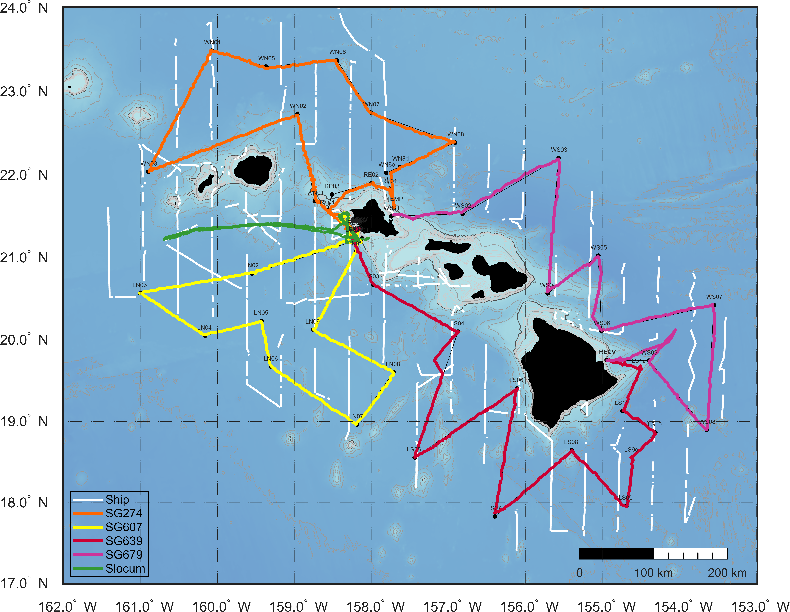

Traditional large-scale surveys of marine mammals are conducted by visual observation from large research vessels. While these surveys collect extremely high-quality data that can be readily analyzed to assess marine mammal populations, they do have their limitations. These methods are complicated for deep-diving species that spend little time at the surface (beaked whales, sperm whales), and they are limited by weather conditions (including fog, rain, and high seas). These surveys are conducted \~ every 5 years during good weather seasons, and so are limited in their ability to assess seasonal and inter-annual variability.

Can PAM-equipped gliders augment existing shipboard surveys to improve our understanding of deep-diving species or to improve our understanding of temporal variability in marine mammal populations?

To address this question, we need to collect data using traditional methods (shipboard visual surveys) and new methods (PAM-gliders) in the same region and at the same time. Data collected during these concurrent surveys are needed to develop and test statistical methods needed to use PAM-glider data to assess marine mammal populations.

We will conduct concurrent shipboard/glider surveys off the U.S. West Coast (CalCurCEAS) and Hawaiʻi (WHICEAS).

Data from these surveys will be used for developing [Spatial Modeling](https://nmfs-ost.github.io/PAM-Stocks/content/gliderStocks.html).

## CalCurCEAS 2024

::: columns
::: {.column width="\"40%"}
Three PAM-equipped Seagliders were deployed out of Newport Oregon and surveyed in a zig-zag pattern south towards Eureka, California:

1.  **SG679:** Offshore Tracks (orange trackline)

    -   63 days (8/23/2024 - 10/25/2024)
    -   Four transects, 297 dives
    -   Surveyed 1459 km trackline
    -   180 kHz sampling, 2.5 Tb data
    -   94% total mission has recordings

2.  **SG639:** Inshore Tracks (yellow); **SG80** (red)

    -   41 days (9/14/2024 - 10/25/2024)
    -   SG639: 6 transects 217 dives, 789 km; bonus transect to Trinidad Canyon
    -   SG80: 8 transects, 232 dives, 806 km
    -   200 kHz sampling, 1.8 Tb data
    -   95% total mission has recordings
:::

::: {.column width="\"60%"}
{width="580"}
:::

The PAM-equipped Seagliders were deployed by collaborator Dave Mellinger from Oregon State University (OSU) with co-piloting by our PIFSC colleagues: Selene Fregosi, Erik Norris, and Calla Lloyd-Lim. The offshore glider was the longest mission of any of the OSU gliders to date! This was also the first time this experienced glider team piloted three gliders simultaneously.
:::

::: columns
::: {.column width="\"50%"}
{width="400"}
:::

::: {.column width="\"50%"}
These PAM-glider tracks overlap in both time and space with the CalCurCEAS shipboard visual observation survey. In addition to visual observations, drifting acoustic recorders were deployed offshore to study beaked whales. This provides an opportunity to compare detection of species offshore Oregon by three different platforms: shipboard visual observation, drifting acoustic recorders, and PAM-equipped gliders. These data will be used to develop the analytical framework for integrating data from slow-moving recording platforms (such as gliders and drifting recorders) into spatial density models for marine mammals (see [Spatial Modeling](https://nmfs-ost.github.io/PAM-Stocks/content/gliderStocks.html)).
:::
:::

## WHICEAS 2026

Concurrently with the Winter Hawaiian Cetacean Ecosystem Assessment Survey (WHICEAS), 5 passive acoustic gliders were deployed within the WHICEAS survey area and collected high-frequency acoustic data from February to April 2026. 

<!-- ::: columns -->

<!-- ::: {.column width="\"65%"} -->
{width="80%"}
<!-- ::: -->

<!-- ::: {.column width="\"35%"} -->
This mission included three types of gliders - a Slocum G3 (green line), a Seaglider SGX (orange line) and three M1 Seagliders (yellow, purple, and red lines). The Slocum was piloted by the SWFSC glider team while the Seagliders were piloted by a team from PIFSC and OSU. SG274, the newest SGX glider, has expanded battery capacity and with that glider we surpassed our previous longest PAM glider deployment (from CalCurCEAS above), surveying over 1500 km in 82 days! 
<!-- ::: -->

<!-- ::: -->

